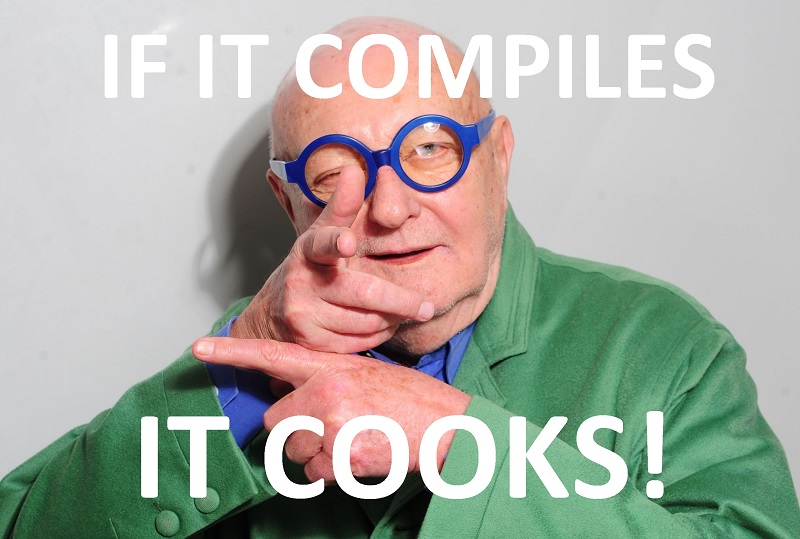

# JPCoffe DSL

A DSL for COOKS :fork_and_knife: :sushi: :cake:

## Working samples list

- bechamel.jpcoffe
- cookies.jpcoffe
- gateau-yaourt.jpcoffe
- omelette.jpcoffe
- panna-cotta.jpcoffe
- puree.jpcoffe

> :warning: Samples not included in this list are not expected to be fully working, mainly because they use unimplemented features.

## Limitation

Grammaire : 

- Quantité : seuls les entiers sont acceptés
- Outils : on peut pas mettre de quantité
- Steps : on peut pas mettre de point et la ponctuation est mal gérée
- Les références vers les ingredients/tools dans les steps n'existent pas

Runtime :

- On ne gère pas les imports
- Non pris en compte
  - ConditionStep
  - Alias
- Pas le choix sur le nombre de portions pour afficher des quantités proportionnelles
- On ne précise pas le nombre de cuisiniers disponibles pour faire la recette


## Syntax sample

```
// Define a recipe
Recipe "Bechamel" {
  
  // Quantity
  For 6 people

  Ingredients
  ------------
  * Farine 50gr
  * Beurre 50gr
  * Lait 60cl
  * Sel

  Tools
  ------
  * Casserole a fond epais
  * Cuillere en bois
  * Rape

  Steps
  ------
  // For each step, you have to give the required predecessors steps
  // using the syntax {PRED_STEP_1, ...} -> STEP_NUMBER. TEXT
  { } -> 1. faire fondre le Beurre dans la Casserole a fond epais
  {1} -> 2. ajouter la Farine et remuer avec une Cuillere en bois
  {2} -> 3. verser le Lait progressivement en remuant jusqu'a ce que la sauce epaississe
  {3} -> 4. assaisonner de Sel, Poivre et Muscade rapee

}
```


